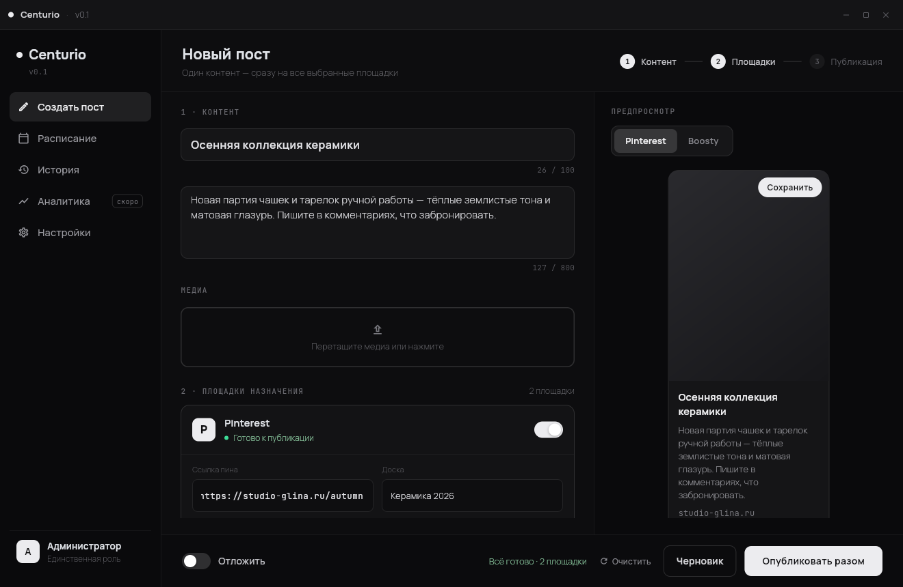

# Centurio — мультиаккаунтный постинг на площадки

Desktop-приложение на **Flet (Python)**: сначала выбирается **площадка**
(**Pinterest** или **Boosty**), затем один или несколько **аккаунтов компании**
на этой площадке — один пост публикуется сразу во все выбранные аккаунты.



## Возможности

- **Мультиаккаунтность** — на каждой площадке заводится несколько аккаунтов
  компании со своими ключами доступа; аккаунтами управляют в «Настройках».
- **Создание поста** — сначала выбор площадки, затем выбор аккаунтов (несколько
  разом), потом контент: заголовок, текст, медиафайлы, для Pinterest — ссылка
  и доска пина.
- **Публикация «разом»** — независимо по каждому аккаунту: ошибка одного не
  прерывает остальные; для упавшего аккаунта доступен повтор в один клик.
- **Отложенный постинг** — дата/время публикации, фоновый планировщик
  (APScheduler) публикует автоматически, пока приложение запущено; задания
  переживают перезапуск (восстанавливаются из БД).
- **Предпросмотр** — как пост будет выглядеть на выбранной площадке (пин
  Pinterest или пост в ленте Boosty) до публикации.
- **Расписание** — список запланированных публикаций, перенос и отмена.
- **История публикаций** — статус каждой публикации по аккаунту (успех/ошибка
  с текстом ошибки), ссылки на опубликованные посты.
- **Аналитика** — раздел-заглушка (по ТЗ, наполняется в следующих итерациях).
- **Авторизация** — single-user логин/пароль (создаётся при первом запуске),
  хэш пароля PBKDF2 в локальной БД.
- **Хранение секретов** — ключи доступа аккаунтов в системном хранилище учётных
  данных ОС (keyring: Windows Credential Manager / macOS Keychain / Secret
  Service), с ключом по id аккаунта; при недоступности — зашифрованный локальный
  файл. Секреты не хранятся в открытом виде ни в коде, ни в БД.
- **Журнал** — технические события (вызовы API, ошибки, повторы) пишутся
  в файл `storage/centurio.log` и в таблицу `logs` БД.

## Запуск из исходников

```bash
pip install -r requirements.txt
python main.py
```

При первом запуске приложение попросит создать логин и пароль администратора.

## Настройка аккаунтов

**Настройки → Аккаунты**: аккаунты сгруппированы по площадкам; «＋ Добавить
аккаунт» создаёт новую учётную запись компании, «Ключи и имя» задаёт секреты
доступа, «Удалить» убирает аккаунт вместе с его ключами.

- **Pinterest** — для каждого аккаунта задаётся токен доступа Pinterest API v5
  (создаётся в [developers.pinterest.com](https://developers.pinterest.com),
  scope `boards:read`, `pins:write`). Доска указывается по имени в форме поста.
- **Boosty** — официального публичного API у Boosty нет (в ТЗ отмечено
  «требуется уточнение»); адаптер использует механизм публикации веб-клиента
  и **сам логинится с прохождением 2FA**, поэтому для нового аккаунта нужно
  ввести всего два поля:
  - **Email аккаунта Boosty** и **Пароль Boosty**.

  Всё остальное подставляется автоматически: имя аккаунта берётся из email,
  параметры почты для кода 2FA (IMAP-сервер и порт) — по домену адреса,
  логин почты — из того же email, а **имя блога определяется само** после
  первого входа. Если у почты включена своя 2FA, в поле «Пароль приложения
  для почты» указывается пароль приложения (app password). Блок
  «Дополнительно» в форме позволяет переопределить имя блога, IMAP-сервер,
  порт и логин почты, если автоопределение не подошло.

  Приложение через headless-браузер (Playwright) проходит форму входа, читает
  код подтверждения с почты (IMAP), сохраняет свежий Bearer-токен и повторяет
  автовход автоматически при следующей публикации, если токен истёк (ответ
  401). Кнопка «Войти автоматически» в Настройках → Аккаунты запускает вход
  вручную (например, для первого входа). Требует
  `pip install playwright && playwright install chromium`. Так как разметка
  страниц Boosty не документирована, автовход может сломаться при изменении
  интерфейса площадки. Учитывайте условия использования Boosty относительно
  автоматизированного доступа к аккаунту.

## Сборка exe для Windows

```bash
pip install pyinstaller
pyinstaller --onefile --windowed --name Centurio --add-data "assets;assets" main.py
```

или средствами Flet: `flet build windows` (требуется Flutter SDK).

База данных, журнал и зашифрованные секреты создаются в каталоге `storage/`
рядом с приложением.

## Архитектура

```
main.py                 # точка входа (Flet)
app/
  core/                 # ядро, не зависит от платформ
    models.py           #   пост, аккаунт, публикация, статусы
    database.py         #   SQLite: посты, аккаунты, публикации, логи, настройки
    accounts.py         #   аккаунты: метаданные (БД) + секреты доступа
    service.py          #   публикация (независимо по аккаунтам), планирование
    scheduler.py        #   APScheduler: фоновые отложенные публикации
    auth.py             #   single-user авторизация (PBKDF2)
    secrets.py          #   keyring / зашифрованный файл для ключей аккаунтов
    logger.py           #   журнал в файл и БД
  platforms/            # адаптеры площадок (publish / preview / validate)
    base.py             #   интерфейс PlatformAdapter + описание кред-полей
    pinterest.py        #   Pinterest API v5 (пины)
    boosty.py           #   Boosty (механизм публикации)
  ui/                   # интерфейс Flet по дизайн-макету
    theme.py            #   палитра и шрифты (поставляются в assets/)
    components.py       #   тумблеры, кнопки, поля, карточки
    app.py              #   оболочка: тайтлбар, сайдбар, навигация, оверлеи
    views/              #   логин, создание поста, расписание, история,
                        #   аналитика (заглушка), настройки/аккаунты
assets/fonts/           # шрифты (Onest, Manrope, JetBrains Mono) — офлайн
```

Новая площадка подключается добавлением одного модуля-адаптера
(`credential_fields`, `publish`, `preview`, `validate`) и его регистрацией в
`app/platforms/__init__.py` — ядро и интерфейс не переписываются. Секреты
доступа задаются для каждого аккаунта отдельно.
